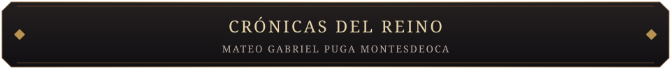
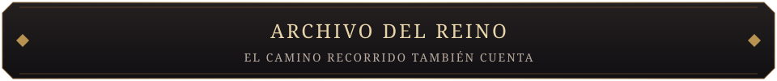

 

**INGENIERÍA DE SOFTWARE · CALIDAD · INTELIGENCIA ARTIFICIAL · AUTOMATIZACIÓN**

*Cada línea de código, un guerrero. Cada proyecto, una conquista.*

 

 &nbsp; 

Portfolio interactivo · Batalla 3D · Proyectos de GitHub

  

Soy **Mateo Gabriel Puga Montesdeoca**, estudiante de Ingeniería de Software en la **UDLA**, desde **Quito, Ecuador**.

Construyo sistemas, analizo requerimientos y automatizo procesos. Me interesa que una buena idea también sea un producto confiable: pruebas, documentación y mejora continua forman parte del trabajo.

<table>
<tr>
<td width="50%" valign="top">

**I · FORJAR**

Desarrollo de software e integración de sistemas. Convertir problemas reales en soluciones claras.

</td>
<td width="50%" valign="top">

**II · PROTEGER**

QA, testing y validación. Cuidar la calidad desde el primer paso.

</td>
</tr>
<tr>
<td valign="top">

**III · DESCUBRIR**

Inteligencia artificial, investigación y análisis de desinformación.

</td>
<td valign="top">

**IV · CONECTAR**

Automatización con n8n y Docker, procesos e integraciones.

</td>
</tr>
</table>

<i>Calidad sobre cantidad. Construir, aprender y volver a forjar.</i>

 

Proyectos y colaboraciones que forman parte de mi recorrido.

| Campaña | Propósito | Mi recorrido |
| :--- | :--- | :--- |
| **VERITAI** | Detección de contenido generado por IA y análisis de desinformación | En desarrollo |
| **Risk Platform** | Plataforma de auditorías y gestión organizacional | Participación completada |
| **CyberLab** | Plataforma educativa de ciberseguridad | Participación completada |
| **EOS** | Migración e integración de sistemas empresariales | Participación completada |

<a href="https://mundrack.github.io">Explorar los proyectos públicos en el portfolio →</a>

 

| Disciplina | Herramientas |
| :--- | :--- |
| **Lenguajes** | Python · JavaScript · TypeScript |
| **Interfaces** | React |
| **Datos** | MySQL · Supabase |
| **Automatización e infraestructura** | n8n · Docker |
| **Control de versiones** | Git · GitHub |
| **Calidad** | QA · Testing · Validación de software |

 

**Primeras campañas.** Conservo estos proyectos como registro de aprendizaje y evolución:

- [**Interconexión de sistemas**](https://github.com/Mundrack/Interconexion_de_sistemas): primeras experiencias con sistemas, conexiones y JavaScript.
- [**Proyecto IA Accidentes**](https://github.com/Mundrack/Proyecto_IA_Accidentes): desarrollo web y primeros acercamientos a la inteligencia artificial.

**El laboratorio sigue abierto.** Experimentos de automatización, inteligencia artificial y seguridad: un espacio para probar ideas, aprender de los errores y mejorar.

 

### EL REINO SIGUE CRECIENDO

Caballeros, zombies y un dragón custodian el portfolio. 
Los proyectos también pueden explorarse sin reproducir la batalla.

  

Quito, Ecuador · Ingeniería de Software · UDLA 
Arte original para Mundrack. La experiencia 3D continúa en desarrollo.

