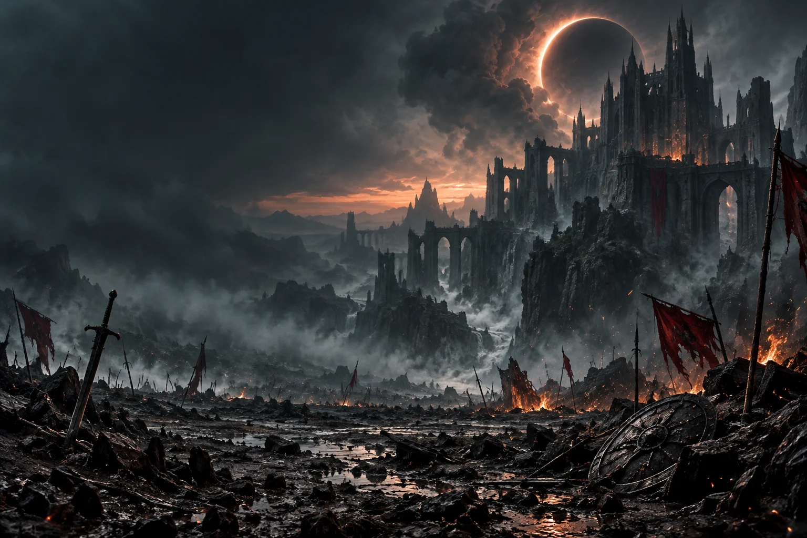

# ⚔️ MUNDRACK ⚔️

### THE KINGDOM OF CODE

**Software Engineering · Quality Assurance · Artificial Intelligence · Automation**

**[⚔️ Explorar el portfolio y la batalla 3D](https://mundrack.github.io)**  
Caballeros, zombies y un dragón custodian los proyectos del reino. Experiencia en evolución.

 

> Cada línea de código es un guerrero.  
> Cada error, un enemigo.  
> Cada proyecto terminado, una victoria.

 

---

## 🏰 Crónicas del reino

Soy **Mateo Gabriel Puga Montesdeoca**, estudiante de Ingeniería de Software en la UDLA.

Construyo sistemas, analizo requerimientos, automatizo procesos y protejo la calidad del código mediante pruebas, documentación y mejora continua.

Este perfil fue depurado bajo una filosofía sencilla:

> **Calidad sobre cantidad.**

Los proyectos que permanecen representan aprendizaje, evolución y propósito. Algunos pertenecen al presente; otros se conservan como evidencia de que todo desarrollador tuvo un comienzo.

---

## ⚔️ Campañas  
### _(Repositorios activos y proyectos principales)_

Aquí se encontrarán los proyectos más importantes del reino: sistemas completos, investigaciones, automatizaciones y desarrollos que continúan evolucionando.

| Campaña | Función real | Estado |
|---|---|---|
| **VERITAI** | Detección de contenido generado por IA y análisis de desinformación | 🟡 En desarrollo |
| **Risk Platform** | Plataforma de auditorías y gestión organizacional | 🟢 Participación completada |
| **CyberLab** | Plataforma educativa de ciberseguridad | 🟢 Participación completada |
| **EOS** | Migración e integración de sistemas empresariales | 🟢 Participación completada |

---

## 🏺 Reliquias  
### _(Repositorios antiguos conservados por historia y nostalgia)_

Estos proyectos no representan mi nivel actual, pero permanecen como testimonio de mis primeros pasos.

- [**Interconexion_de_sistemas**](https://github.com/Mundrack/Interconexion_de_sistemas)  
  Primeras experiencias trabajando con sistemas, conexiones y JavaScript.

- [**Proyecto_IA_Accidentes**](https://github.com/Mundrack/Proyecto_IA_Accidentes)  
  Primeros acercamientos al desarrollo web y a proyectos relacionados con inteligencia artificial.

---

## 🛡️ Arsenal  
### _(Tecnologías, herramientas y habilidades)_

---

## 🧪 Sala del Nigromante  
### _(Experimentos, prototipos y laboratorios)_

Espacio reservado para pruebas, automatizaciones, inteligencia artificial, seguridad, integraciones y proyectos que todavía están tomando forma.

Aquí las ideas pueden fallar, transformarse y volver más fuertes.

---

## 👤 Sobre mí  
### _(Perfil profesional)_

- 🎓 Estudiante de Ingeniería de Software en la **UDLA**
- 🧪 Experiencia en **QA, testing y validación de software**
- ⚙️ Automatización de procesos con **n8n y Docker**
- 🧠 Desarrollo e investigación con **inteligencia artificial**
- 🔐 Interés en **ciberseguridad y sistemas empresariales**
- 📍 Quito, Ecuador

---

### 🐉 El reino interactivo está siendo forjado

El portfolio ya incluye una batalla 3D con caballeros, zombies, un dragón y proyectos públicos de GitHub. Puedes explorar los repositorios sin reproducir la escena.

**Los proyectos aparecen como pequeñas etiquetas sobre los soldados caídos.** Estamos mejorando la animación y preparando una presentación cinematográfica medieval. La portada de este perfil es una ilustración estática; el tráiler animado llegará después.

 

