

<a href="https://mundrack.github.io">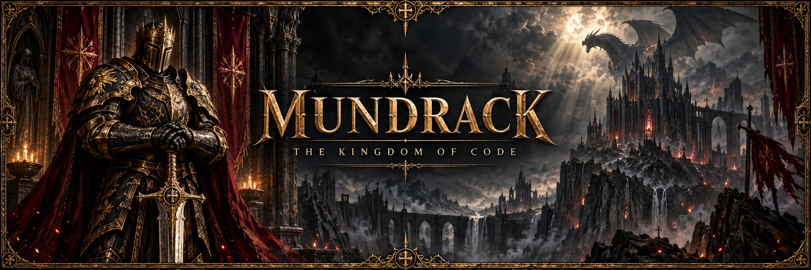</a>

<a href="#perfil-en-texto">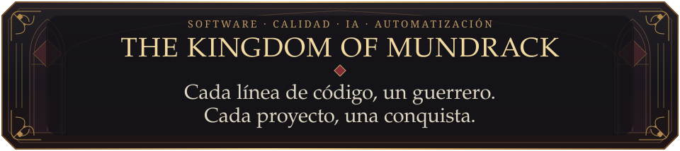</a>

<a href="https://mundrack.github.io">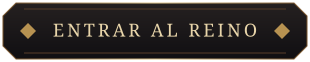</a> <a href="https://github.com/Mundrack?tab=repositories">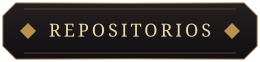</a>

<a href="#perfil-en-texto">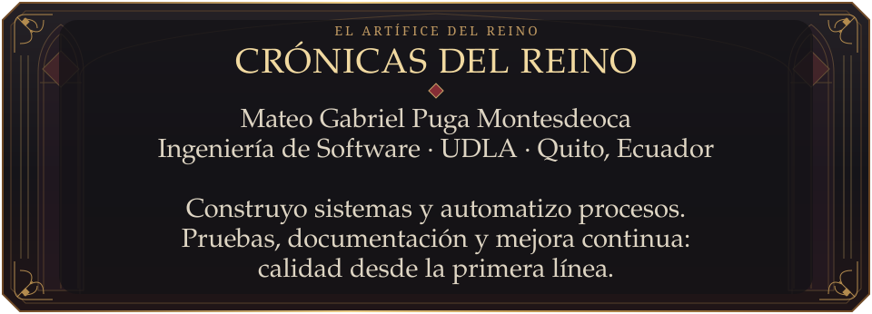</a>

<a href="#perfil-en-texto">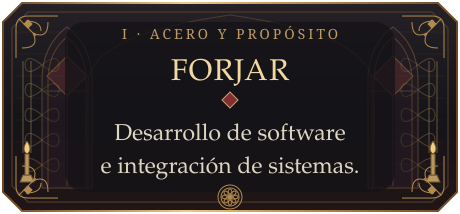</a>
<a href="#perfil-en-texto">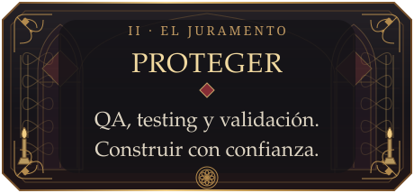</a>

<a href="#perfil-en-texto">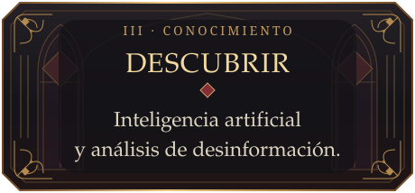</a>
<a href="#perfil-en-texto">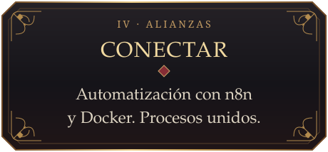</a>

<a href="#perfil-en-texto">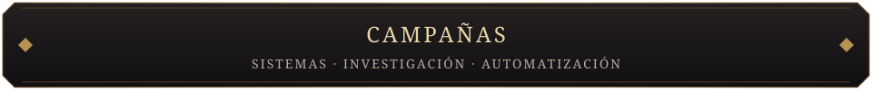</a>

<a href="#perfil-en-texto">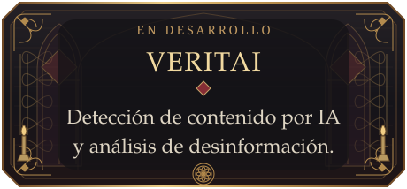</a>
<a href="#perfil-en-texto">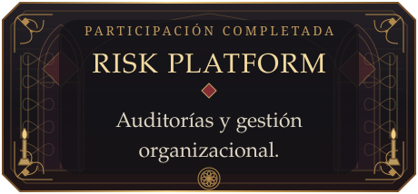</a>

<a href="#perfil-en-texto">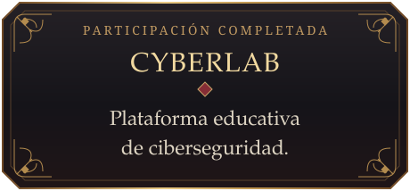</a>
<a href="#perfil-en-texto">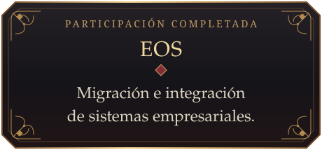</a>

<a href="#perfil-en-texto">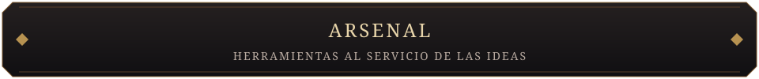</a>

<a href="#perfil-en-texto">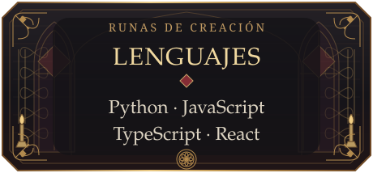</a>
<a href="#perfil-en-texto">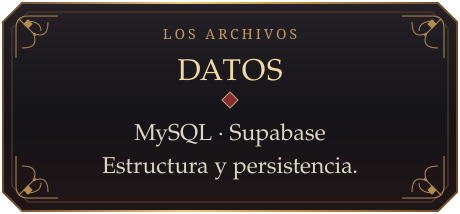</a>

<a href="#perfil-en-texto">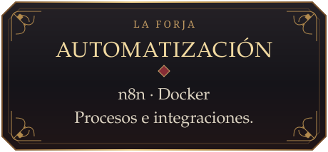</a>
<a href="#perfil-en-texto">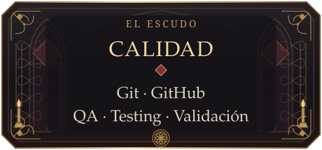</a>

<a href="#perfil-en-texto">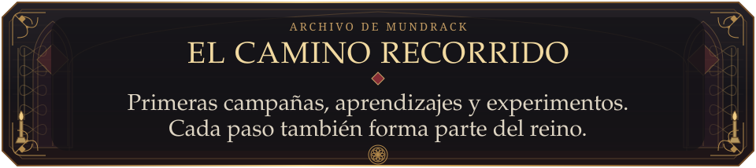</a>

[Interconexión de sistemas](https://github.com/Mundrack/Interconeccion_de_sistemas) · [Proyecto IA Accidentes](https://github.com/Mundrack/Proyecto_IA_Accidentes)

<a href="https://github.com/Mundrack/SegundoSemestre">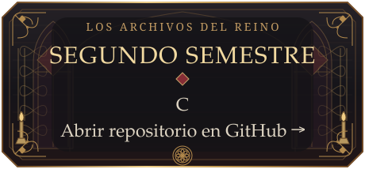</a>
<a href="https://github.com/Mundrack/PraticaArchivos">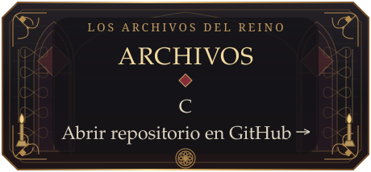</a>

<a href="https://github.com/Mundrack/proyectoFinalSeguirdadInformatica">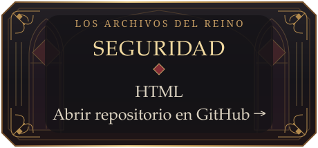</a>
<a href="https://github.com/Mundrack/Proyecto_IA_Accidentes">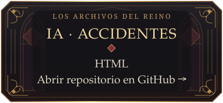</a>

<a href="https://github.com/Mundrack/Interconeccion_de_sistemas">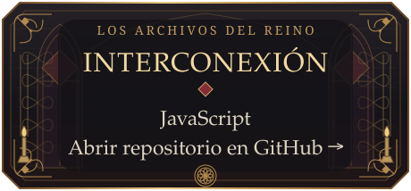</a>
<a href="https://github.com/Mundrack/Gremio">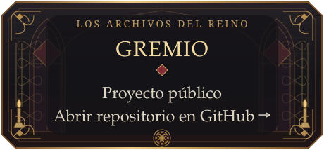</a>

<a href="#perfil-en-texto">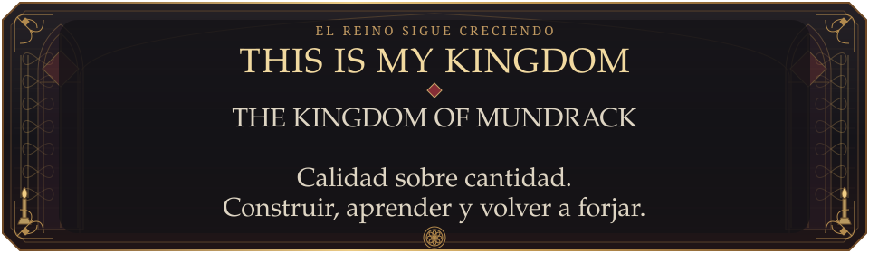</a>

 

<a href="https://mundrack.github.io">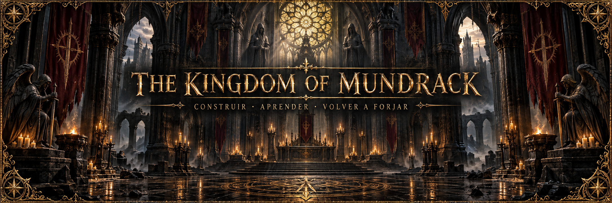</a>

Leer el perfil en texto · Información y enlaces accesibles

## Mateo Gabriel Puga Montesdeoca

Estudiante de Ingeniería de Software en la UDLA, Quito, Ecuador. Construyo sistemas, analizo requerimientos y automatizo procesos. Trabajo con pruebas, documentación y mejora continua.

- **Desarrollo:** software e integración de sistemas.
- **Calidad:** QA, testing y validación.
- **Investigación:** inteligencia artificial y análisis de desinformación.
- **Automatización:** n8n y Docker.

### Proyectos y colaboraciones

- **VERITAI:** detección de contenido generado por IA y análisis de desinformación. En desarrollo.
- **Risk Platform:** auditorías y gestión organizacional. Participación completada.
- **CyberLab:** plataforma educativa de ciberseguridad. Participación completada.
- **EOS:** migración e integración de sistemas empresariales. Participación completada.

### Herramientas

Python, JavaScript, TypeScript, React, MySQL, Supabase, n8n, Docker, Git y GitHub.

### Archivo y laboratorio

[Interconexión de sistemas](https://github.com/Mundrack/Interconeccion_de_sistemas) y [Proyecto IA Accidentes](https://github.com/Mundrack/Proyecto_IA_Accidentes) conservan mis primeros aprendizajes. Sigo explorando automatización, inteligencia artificial y seguridad.

[Entrar al portfolio](https://mundrack.github.io) · [Ver repositorios](https://github.com/Mundrack?tab=repositories)

El portfolio incluye una batalla 3D en evolución; los proyectos pueden explorarse sin reproducirla. El arte del perfil es original y estático.

